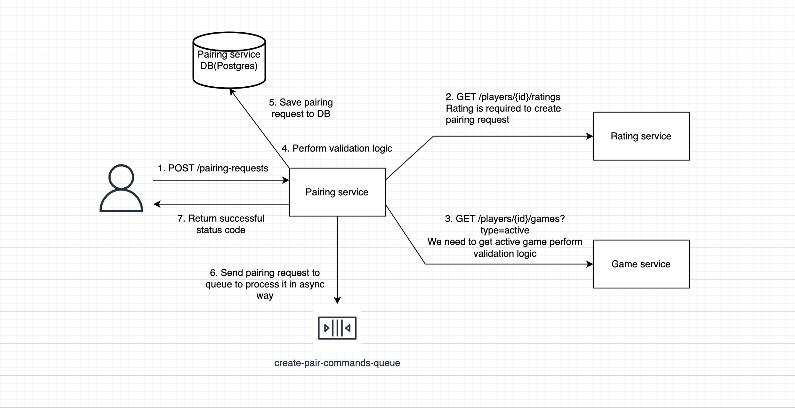
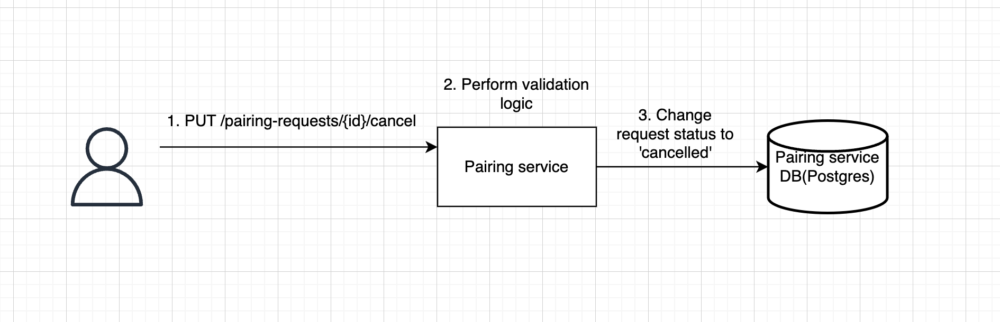
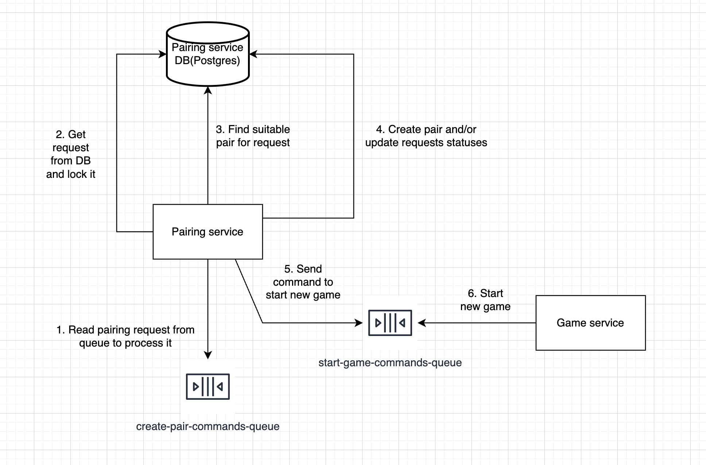
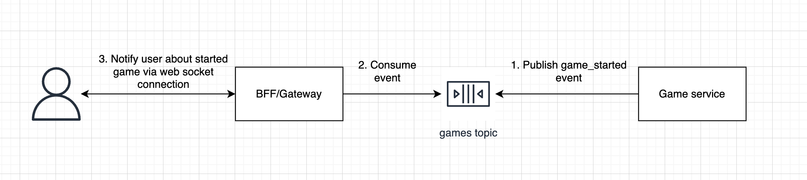
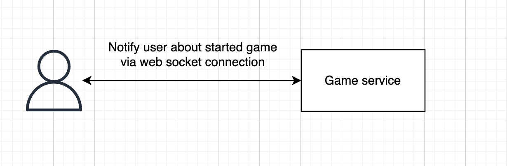

## Pairing service database:

```
create table pairing_requests (
	id uuid primary key,
	player_id uuid not null,
	game_type game_type not null, # postgres enum: bullet, blitz, rapid, classic
	game_duration duration not null,
	game_increment duration not null,
	rating_range numrange not null, # See https://www.postgresql.org/docs/9.5/functions-range.html
	status pairing_request_status not null,  # postgres enum: active, waiting_for_pair, completed, cancelled
	created_at timestamp not null
);

create table pairs (
	id uuid primary key,
	pairing_request1_id uuid not null,
	pairing_request2_id uuid not null,
	created_at timestamp not null
);
```


## Create pairing requests:

### Endpoint:
```
POST /pairing-requests
{
  "id": "aa142f04-be3b-46e9-b1c5-ebe58dc77e59", // to avoid duplicated requests from clients
  "game_type": "bullet", // bullet, blitz, rapid, and classic
  "game_time_controls": {
    "duration": 144214,
    "increment": 144214
  }
}
```

### Diagram:


### Endpoint logic:
#### Step 1: Validate the request by the following rules:
- If the user already has an active game (request to Game service) -> Return HTTP 400 Bad Request.
- If the user already has an active or waiting_for_pair pairing request with the same game_type and game_controls -> Return HTTP 400 Bad Request.
- If the user's rating is less than 1500 (request to Ratings service) -> Return HTTP 400 Bad Request.
- If a request with the same ID already exists -> Return HTTP 400 Bad Request.

#### Step 2: Save pairing request to the database (Postgres).

#### Step 3: Send a command to create a pair to the queue (SQS, Kafka, etc.).
```Partition key (in Kafka) or MessageGroupId (in SQS) = game_type + "-" + game_duration + "-" + game_increment```
It is good idea to use the outbox pattern to avoid missing messages due to errors.

Message (command) example:
```
{
  "pairing_request_id": "aa142f04-be3b-46e9-b1c5-ebe58dc77e59"
}
```

#### Rationale for Using a Queue:
Let's imagine the following situation:
There are 4 users with a rating of 1000, and they send pairing requests with the same game type and game time controls simultaneously.
We need to match them one by one. While we could use Redis or Postgres transactions, or distributed locks to achieve this behavior, it might lead to challenges such as:
- Long response times.
- High cognitive complexity of the code (pairing logic intertwined with request creation and validation), making it harder to read, test, and maintain.
- It may decrease the number of transactions per second (TPS) the service can handle.
- Issues with database locks, deadlocks, etc.

#### Advantages of Asynchronous Solution:
- It helps manage spikes in request load more easily.
- Pairing logic can run in the background and be scaled independently of the request handling logic.
- Increases the number of TPS the service can handle.
- Provides fast HTTP response times.

As a result, achieving a queue effect ensures that all players selecting the same game type and game time controls are paired sequentially. Using an asynchronous approach makes sense in this context, providing a more scalable and maintainable solution.

By using an asynchronous processing pattern, you can decouple the request handling from the pairing logic, thus simplifying the design and improving system performance.

#### Step 4: Return 200 or 201 status code


## Cancel pairing requests

### Endpoint:
```PUT /pairing-requests/{id}/cancel```

### Diagram:


### Endpoint logic:

#### Step 1: Retrieve and Lock the Pairing Request
Retrieve the pairing request from the database by ID and lock it to prevent race conditions during the cancellation or pairing process. This prevents cancelling requests that are already paired or completed, potentially causing an inconsistent state.

SQL Query Example:
```
SELECT * FROM pairing_requests WHERE id = 'pairing_request_id' FOR UPDATE;
```

#### Step 2: Validate the Request with the Following Rules:
- If the pairing request does not exist, return HTTP 404 Not Found.
- If the status is 'active' or 'waiting_for_pair', update the status to 'cancelled' and return HTTP 200 or 204.
- If the status is 'completed', return HTTP 400 Bad Request, indicating that the request cannot be cancelled.
- If the status is 'cancelled', return HTTP 200 or 204 as the request is already cancelled.

**Notes:**
Locking: Use FOR UPDATE in the SQL query to lock the row during the transaction. This prevents concurrent operations that could lead to inconsistent states.


## Pairing consumer

**Note:** 
The consumer should be idempotent to ensure the same message processed multiple times does not lead to inconsistent state updates.

### Diagram:


### Logic:
#### Step 1: Read Pairing Request from the Topic/Queue
Fetch the message from your message broker (e.g., Kafka, SQS).

#### Step 2: Retrieve and Lock Pairing Request
Fetch the pairing request from the database using the provided pairing_request_id in the message, and lock the row to prevent concurrent operations:

```
SELECT * FROM pairing_requests WHERE id = 'message.pairing_request_id' FOR UPDATE;
```
Locking the pairing request prevents concurrent cancellations during the pairing process, thereby maintaining a consistent state.

Condition: If the status is not 'active', skip the pairing process for this request.

#### Step 3: Find a Pair for the Player

Attempt to find another pairing request that matches the game specifications and is suitable for pairing:

```
SELECT * FROM pairing_requests
WHERE game_type = pairingRequestFromMessage.GameType
  AND game_duration = pairingRequestFromMessage.GameDuration
  AND game_increment = pairingRequestFromMessage.GameIncrement
  AND rating_range && pairingRequestFromMessage.RatingRange -- Check range overlap
  AND status = 'waiting_for_pair'
FOR UPDATE;
```

If no pair is found: Update the status of the request to 'waiting_for_pair'.
```
UPDATE pairing_requests
SET status = 'waiting_for_pair'
WHERE id = pairingRequestFromMessage.Id;
```

If a suitable pair is found: Create a pair and update the status of both pairing requests to 'completed'.
```
INSERT INTO pairs (id, pairing_request1_id, pairing_request2_id, created_at)
VALUES (
    'some-uuid',
    pairingRequestFromMessage.Id,
    foundPairingRequest.Id,
    NOW()
);
```
```
UPDATE pairing_requests
SET status = 'completed'
WHERE id IN (pairingRequestFromMessage.Id, foundPairingRequest.Id);
```

Transactional Consistency: Ensure all database changes occur within a single transaction to maintain integrity. This prevents situations where one request is updated but not the other.

#### Step 4: Notify Game Service to start a game.
Once a pair is formed, notify the Game service to start a new game. You can send a command or an event in case if you have multiple consumers

Command Example:
```
{
  "player1_id": "aa142f04-be3b-46e9-b1c5-ebe58dc77e59",
  "player2_id": "bb142f04-be3b-46e9-b1c5-ebe58dc77e60",
  "game_type": "bullet",
  "game_time_controls": {
    "duration": 144214,
    "increment": 144214
  }
}
```
Use Outbox Pattern: Implement an outbox pattern to ensure messages are not lost due to errors. This provides a reliable mechanism for eventual message delivery, aligning with the principles of distributed systems for maintaining data consistency across services.


## Create Game Logic (Game Service)
The Game Service is responsible for validating that players cannot have more than one active game at a time. Implementing this logic in the Pairing Service is not advisable, as there may be several options for starting a game. For example, when I want to play with my friend, I don’t need to create a pairing request; I can simply send a command to the Game Service to start a game with my friend.

### Logic:
#### Step 1: Read the command message from the topic/queue.

#### Step 2: Create a game record in the database.
Since we have several instances of the Game Service processing commands simultaneously, we need to ensure that players do not have more than one active game at a time. This can be achieved by using a Redis or PostgreSQL transaction, distributed locks, etc. While this logic needs to be implemented, it is beyond the scope of this task, so I will skip the detailed implementation here, but it’s important to note this requirement.

#### Step 3: Notify players about the game start via WebSocket or HTTP polling.

#### Solution 1 diagram (better scalability):


#### Solution 2 diagram (simplified):


There are a lot of possible solutions here. It should be selected based on your needs.


## Game Finished Logic:
When a game is finished, we need to publish an event to the Ratings Service to update the users' ratings.

Event Example:
```
{
    "game_id": "aa142f04-be3b-46e9-b1c5-ebe58dc77e59",
    "winner_id": "aa142f04-be3b-46e9-b1c5-ebe58dc77e59",
    "loser_id": "bb142f04-be3b-46e9-b1c5-ebe58dc77e60"
}
```

## Additional notes:
The pairing logic can be viewed as a distributed transaction. We can use Temporal or other approaches to handle this distributed transaction. There are multiple ways to solve this task, and you should select a solution based on your functional and non-functional requirements.